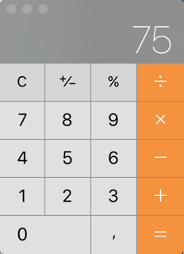

# DHA Hybrid Calculator - 2019 edition

Deze app is een introductie in Ionic en hybrid development. Het individueel afronden van deze app is een voorwaarde om met een koppel de volgende apps te gaan maken. Voor de volgende apps heb je hiermee al een aantal hobbels weggenomen. Laat hem na afronden dus beoordelen en aftekenen door de docent.

Je leert:
- je MacBook in te richten als ontwikkelomgeving voor hybrid apps
- een goede README te schrijven, die je bij volgende apps deels kunt hergebruiken.
- deployen naar een echt device (je eigen device :)). 

Denk bij dit laatste ook aan randvoorwaarden, zoals de installatie van XCode of Android Studio en Java SDK's en benodigde updates heb je voor elkaar en kun je je weg mee vinden. Ook ogenschijnlijk triviale zaken zoals dat je wel een goed snoertje moet hebben (met niet alleen de voedingsconnecties) zijn van belang. Je kunt ook met git omgaan en code committen naar je remote repository in GitHub. Als je hier nog geen ervaring mee hebt, zal dit ook tijd kosten en wat uitzoekwerk vereisen.

Volg eerste de startup hieronder, en maak daarna de hele calculator met de info uit 'Hoe verder'.

## 1. Startup
Zo moet je opstarten:
- [ ] A. Herschrijf dit bestand met je eigen (verplichte) `README.md` (verplicht met goede *markdown* kopjes, klik [hier](https://guides.github.com/features/mastering-markdown/), of google zelf als je dit niet kent).
- [ ] B. Sla de content van dit bestand even op in een nieuw bestand `beoordeling.md`.
- [ ] C. Installeer daarna *NodeJS* en *Ionic* volgens de howto in de [Ionic documentatie](https://beta.ionicframework.com/docs/installation/cli).
- [ ] D. Maak daarna de calculator app :)

Voor het laatste maken vind je in de sectie hoe verder onder meer hulp, zoals walkthrough video's, minimale eisen en een volledige beoordelingsmodel.

## 2. Hoe verder?
Als je de startup hebt gedaan kun je met de info in deze sectie je Ionic deepdive afronden. In sectie 1 walkthrough video's. De vereiste vormgeving voor de calculator vindt je onder sectie 2. Een beoordelingsmodel om te checken of je app voldoet staat onder 3.*

### 2.1 Video hulp en instructies
In de volgende twee video's zie je een docent voordoen hoe te beginnen met de calculator app. 
- [YouTube - Calculator - Deel 1](https://www.youtube.com/watch?v=twFWRCoDNeY) - `Hello Ionic`
- [YouTube - Calculator - Deel 2](https://www.youtube.com/watch?v=NZDRfn2enTU) - `Buttons and ops`

NB Deze tutorial in gemaakt in Ionic 3, maar we gaan werken met Ionic 4 die net ([januari 2019](https://blog.ionicframework.com/introducing-ionic-4-ionic-for-everyone)) gereleased is. Ga uit van Ionic's documentatie en de nieuwe CLI om zaken te maken.

*Gebruik bij het aanmaken van de calculator repo met ionic cli de `blank` template en geef ook de `--no-git` optie van de Ionic CLI op. Dit omdat je al in een git repo werkt (anders maakt de Ionic CLI van je werkfolder een geneste git repo maakt):
`ionic new blank --no-git`

Op het eind moet je nog een stukje functionaliteit toevoegen en ook de layout customizen om je CSS/SASS kennis toe te passen. Voor degene die het kennen, dit is de Calculator App uit een van Paul Hagerty's iOS/Swift courses op iTunesU, maar dan in Ionic met TypeScript (i.p.v. in XCode in Swift).

### 2.2 Vormgeving
De volgende twee screenshots illustreren de gewenste layout/kleuren en het principe van extra knoppen in Landscape mode vs Portrait. Je mag ook een andere layout realiseren, als je maar zorgt dat je de standaard Ionic layout aanpast.

#### Portrait

#### Landscape

### 2.3 Wat moet ik minimaal doen?
Je hebt een voldoende als je aan de onderstaande eisen voldoet:

- [ ] 1. README: Je hebt een goede `README.md` geschreven m.b.v. markdown syntax en in de root folder
- [ ] 2. Berekeningen: Zoals in video gedemo'd en je hebt minstens twee werkende knoppen/operatoren toegevoegd**
- [ ] 3. Layout: Conform de macOS of iOS calculator (zie screenshots) of andere layout dan de standaard Ionic
- [ ] 4. Responsive: De app toont in landscape mode meer knoppen dan in portrait mode, beide in nette grid
- [ ] 5. Deployment: Je hebt de app naar eigen device én browser gedeployed, broncode staat in je remote GitHub repo

#### Aandachtspunten hierbij
- De laatste punten 3, 4 en 5, zijn dus uitbreidingen en NIET in de video('s) voorgedaan (responsive wordt wel start mee gemaakt).
- **Ad. 3 Voorbeelden van extra berekening:
    - xy (x tot-de-macht y)
    - delen door
    - maar mag ook unary operator zijn
    - bv. gewoon Wortel, ex of ¹⁄ₓ
- Zorg ervoor dat je 'unaire operaties', zoals `%` direct werken op de huidige waarde die het display toont. Dus als er `30`in het display staat en je drukt op `%` verandert de waarde direct naar `0.3`. Zorg er ook voor dat zaken werken als .
- Gebruik voor de berekeningen NIET JavaScripts `eval` functie.
- Je hoeft NIET te zorgen dat je app ook decimale getallen ondersteunt (laat de `.` knop dan disabled, als je dit wel realiseert, mooie uitdaging voor bonuspunten).
- Je hoeft niet JavaScript `quirks` af te vangen, zoals dat `0.2 + 0.6` is `0.8999999999999999` (mocht je decimale getallen wel ondersteunen)

### 2.4 Volledig beoordelingsmodel/Rubric
De 1e app krijgt GEEN cijfer beoordeling, maar is een vink en een vereiste voordat je door mag met app-2. Bij app-2 en app-3 werken we wel met  cijferbeoordeling volgens een 'zogenaamde' rubrics format. Om alvast te wennen aan dit format, hieronder alvast een model, die je kunt gebruiken voor een self-assessment.

NB Voor een vink moet je dus wel minimaal een 6 halen, dus alles wat bij **`6** staat is verplicht.

- [ ] 1. README 
    - **1** Er is geen README.md aanwezig, of dit is de standaard door Ionic gegenereerde
    - **4** Onduidelijke, onvolledige of onprofessionele tekst in de README, geen markdown kopjes of functionele beschrijving of how-to-run ontbreken
    - **6** De README is gestructureerd met kopjes en geeft een korte functionele beschrijving van de app en de stappen die een andere developer moet nemen om het lokaal aan de praat te krijgen in de browser en op een device
    - **8** De README bevat een uitgebreide beschrijving met screenshots, en legt ook duidelijk alle stappen uit die je moet nemen, ligt externe dependencies kort toe met links, zoals install van nodeJS, zodat gebruiker geen enkele voorkennis nodig heeft.

- [ ] 2. Berekeningen
   - **1** Er zijn geen bereken knoppen of deze werken niet
   - **4** Sommige bereken knoppen werken niet, je kunt niet doorrekenen met een resultaat, je hebt `eval` gebruikt, of bij unaire operaties moet nog op `=` drukken
   - **6** Alle berekeningen doen het en er is minstens één extra berekening toegevoegd.
   - **8** Er zijn meerdere berekeningen toegevoegd

- [ ] 3. Layout
    - **1** Layout is niet correct, niet met Ionic Grid en/of bevat HTML fouten
    - **4** Niks customs aan layout gedaan (alleen default Ionic grid)
    - **6** Correcte layout van Mac/iOS calculator (vierkante ipv ronde knoppen, geen marges ertussen, juiste knopkleuren)
    - **8** Custom en mooi design

- [ ] 4. Responsive
    - **1** Niet responsive, geen Ionic Grid of andere oplossing en/of bevat HTML fouten
    - **4** In landscape (of portrait) mode nemen knoppen horizontaal niet hele scherm in
    - **6** Layout correct met Ionic grid, in portrait mode verschijnen een aantal extra berekeningen
    - **8** Verder verder verdiept in Ionic grid, ook verticaal flexbox, of 'devicerotation' event afvangen en schermlogica

- [ ] 5. Deploy
    - **1** Niet gedeployed op device en/of geen code op github
    - **4** Je kunt de app alleen deployen naar simulator of tonen via [DevApp](https://ionicframework.com/docs/pro/devapp/)
    - **6** Je hebt de app gedeployed naar je eigen device, kunt hem tonen, code staat in GitHub
    - **8** Zoals 6 maar met eigen inbreng, zoals PWA features [via github.io](https://github.com/angular-schule/angular-cli-ghpages), eigen app icoon, splashscreen, appnaam en bundle identifier
