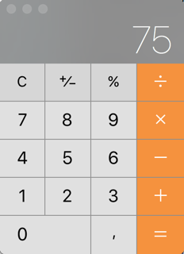
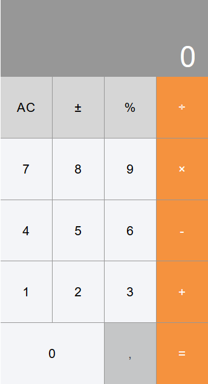
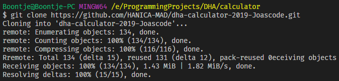
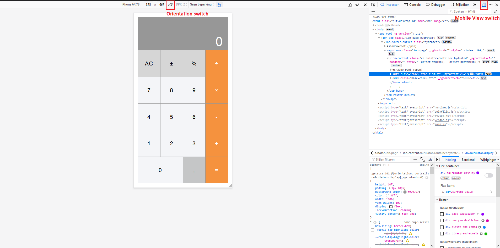

# DHA Hybrid Calculator - 2019 edition

## 1. Description

This repository contains the calculator application created for the (D)evelop (H)ybrid Applications course.
It resembles the original iOS calculator found on many of the apple products. Below are screenshots of the original calculator and the one created to look like it.

**Original calculator**

**Created calculator**

This application is build using a Hybrid framework, called Ionic. See this link https://ionicframework.com/ for more information about Ionic.

## 2. Prerequisites

To get started with the application in this repository, you need the following products installed.

- NodeJS version 11.6.0 (with npm version 6.5.0-next.0)
- Ionic CLI version 4.10.2
- If you want to deploy to your phone, you require a bit more:

  - Android Studio (https://developer.android.com/studio/run/device)

  _Use this StackOverflow post to fix license agreements issues when running the commands to build the application for Android: https://stackoverflow.com/questions/40383323/cant-accept-license-agreement-android-sdk-platform-24/40383457#40383457 If the commands in the post fail, try to execute them as admin in the original command line tool of Windows._

  - Java JDK (https://openjdk.java.net/install/)

  _It seems Cordova asks for version 1.8, which is JDK 8. Get the official version from Oracle https://www.oracle.com/technetwork/java/javase/downloads/jdk8-downloads-2133151.html and setup the PATH properly: https://docs.oracle.com/cd/E19182-01/820-7851/inst_cli_jdk_javahome_t/ && windows troubleshooting in case you set previous PATH to \bin: https://stackoverflow.com/questions/45182717/java-home-is-set-to-an-invalid-directory/49592887_

  - XCode (https://developer.apple.com/xcode/)

You install Ionic via NodeJS. So to get everything installed properly, you start with NodeJS.
Follow the steps below to get all the prerequisites installed.

(1) There are a couple of ways to get NodeJS installed. If you prefer to use multiple NodeJS versions on your machine, I recommend getting NVM installed. NVM stands for Node Version Manager. NVM makes it possible to switch easily between Node versions. NVM does require some setup, so if you want to start immideatly and don't use different versions of Node, I could recommend using Node directly.

- Install of NVM: https://github.com/creationix/nvm (after install you can download Node via NVM on the command line. Specify which version you need, you can't say latest unfortunately).
- Install NodeJS directly: https://nodejs.org/en/download/ (search for a specific version, or use the latest version if you want).

(2) To get Ionic, use the following command in the terminal (any location inside your terminal): <code>npm install -g Ionic</code> or <code>npm i -g Ionic</code> if you prefer shorter commands.
If you want to use the same version as I used, use the following command instead: <code>npm install -g Ionic@4.10.2</code>. You can use <code>npm install -g Ionic@^4.0.0</code> if you want to use the latest minor version of 4.0.

This command will install (install / i) the latest version of Ionic globally (-g) for npm. If you are using NVM, the global scope will be tied to your active version of node. If you switch to a different version, it won't be able to find Ionic globally anymore, until Ionic is installed globally for that version as well.

To test if Ionic is installed correctly, type: <code>Ionic --version</code> in your terminal. If it says the command Ionic is unknown, try closing the terminal and type the command in a new terminal. If it still fails to recognize the command, try troubleshooting on the internet. Unfortunately the Ionic website does not got any recommendations for troubleshooting.

## 3. Cloning the application

With the prerequisites installed, you can get the repository on your machine via Git. If you don't got Git installed on your machine, please follow these links:

- For Mac and Linux: https://git-scm.com/book/en/v2/Getting-Started-Installing-Git
- For Windows users: https://gitforwindows.org/

If you are unsure wether you got Git installed or not, type <code>git --version</code> in a terminal. If you see a version number, you got Git installed.

If Git is installed, get this repository on your machine via the following steps:

- If you are using HTTPS clones: <code>git clone https://github.com/HANICA-MAD/dha-calculator-2019-Joascode.git</code>
- If you are using SSH clones: <code>git clone git@github.com:HANICA-MAD/dha-calculator-2019-Joascode.git</code>

Type one of these commands in your terminal in the directory where you want the repository cloned to. In my case I use a projects folder inside my Documents folder. If I boot up a terminal, I switch to this folder using the following command: <code>cd Documents/projects</code>. See the screenshot for clarity. For Windows users it might be required to type <code>cd ./Documents/projects</code>.

Once the cloning is completed, your terminal might look something like this:

If that's the case, the repository now resides on your machine and you are able to run the application.
If it's not the case, please troubleshoot the error message in Google or a different search engine.

## 4. Running the application

With the repository on your machine, you are able to run the application in multiple fasions: in the browser, or on your mobile.

### 4.1 Browser

To run the application in the browser, follow the steps below from the folder in which you cloned the repository to.

- Step into the cloned folder: <code>cd dha-calculator-2019-Joascode/code/dha-calculator</code>
  _My apologies for the strange folder structure._
- Once inside the dha-calculator folder, type the following command: <code>npm install</code> This command will install all the required dependencies. If you want to know which dependencies these are, check the package.json file inside the dha-calculator folder. This command will take a while, since Ionic requires quite alot of dependencies.
- Once the npm install command finishes, you are able to run the application in the browser. Simply type <code>ionic serve</code> This command will load up Ionic to serve your application. It uses Angular in the background and requires some time to fully boot. Once loaded, it will open up a browser tab for the application with the required url. If you make adjustments inside the code and hit save, the ionic serve command will notice these changes and do a reload of the page.

If all went well, the application should be visible inside your default browser. If the installation fails for some reason, try to troubleshoot the error in your favorite search engine. If you see yellow warning messages, you could ignore them for now since they won't fail the installation. Though it's a good practice to try to resolve those as well.

If you want to see the web application as a mobile window view. Follow the next few steps:

- Right click somewhere in the browser tab in which the calculator is shown and select 'inspect element' or press F12 (for Firefox and Chrome atleast).
- Inside the inspector, you'll find an icon in the top most bar which resembles a phone and a tablet on top of each other. Click this icon. (see screenshot for clarity)

Now you got the calculator shown inside a mobile window view. You can select different types of phones / tables in the bar above the calculator. You can also switch orientation in this bar. See screenshot below for the appropriate buttons.

### 4.2 On Mobile

There are two ways to run the application on a mobile.

- Ionic DevApp: Extends the capabilities of Ionic Framework. It runs as a realtime view, when changes are detected it will refresh the app. It requires the DevApp app of Ionic, downloaded from the App Store or Google Play.
- Via a build process: Ionic builds the project to their respective targets: Android or iOS. This requires Cordova or Capacitor, as these frameworks build the application to the specific target.

For more information on both deployment strategies, read: https://ionicframework.com/docs/building/running/. I will handle the steps required for Android deployment via the build proces in this README, since I used that for deploying the application to my phone.

#### 4.2.1 Deploying to Android via Build process

The following steps are required to build the application for Android:

- Make sure Android Studio is installed, since it's required to deploy the application to your Android phone. There might be other ways, but I'm not knowledgable about those.
After install, be sure to set it up properly with your phone. Check the following link for more information: https://developer.android.com/studio/run/device. For Windows users it might be a hassle to configure the connection to your phone properly. Read the link carefully, if anything goes wrong, the article helps you a long way.
- Connect your phone or tablet via the USB.
- Install cordova via the command line: <code>npm i -g cordova</code>. This command will install cordova globally, same way as it did with Ionic earlier. Cordova is required because it will be responsible for building the project to the specific target.
- Once installed, go to the project folder where the application resides. If you cloned the project, you have to change the directory: <code>cd (location of cloned repository)/code/dha-calculator</code>.
- (this step might be skipped, try step 7 first) Once inside the appropriate directory, run: <code>ionic cordova prepare android</code>.
- If the Android platform is not found on your machine, the command will ask you if you want to install it. Press Y and Enter/Return if it does.
- The command will execute and build the application.
- Once the command is ready, fire off the next command: <code>ionic cordova run android</code>
- Once that command finishes without errors, the application should be visible on your phone or tablet.

## 5. Missing functionality

The application is not fully functional yet. Below is a list of missing functionalities:

- Not every button on the calculator is implemented. Buttons that lack implementation are disabled. These are:
    - Open and closed brackets (the way the calculator is implemented you won't miss these).
    - 2nd Button won't swap the functionalities to special functionalities.
- Floating point numbers can dissapear on the display. This happens when the floating point number is too big and the result is simply too long for the display. This can be resolved by simply rounding out the number earlier or use a CSS overflow to jump to the next line, to spread the result over multiple lines. Either solution has not been implemented yet.

